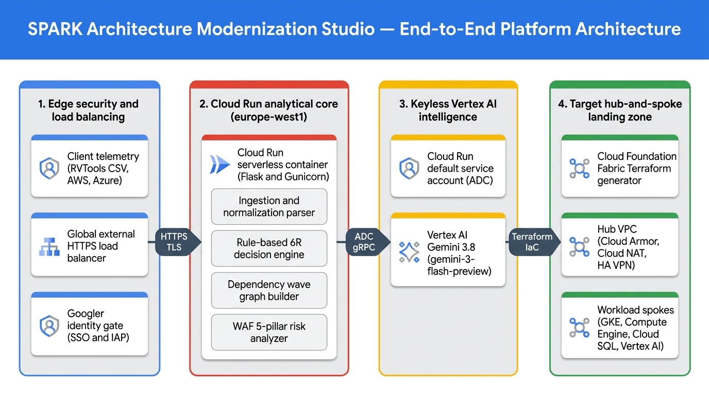
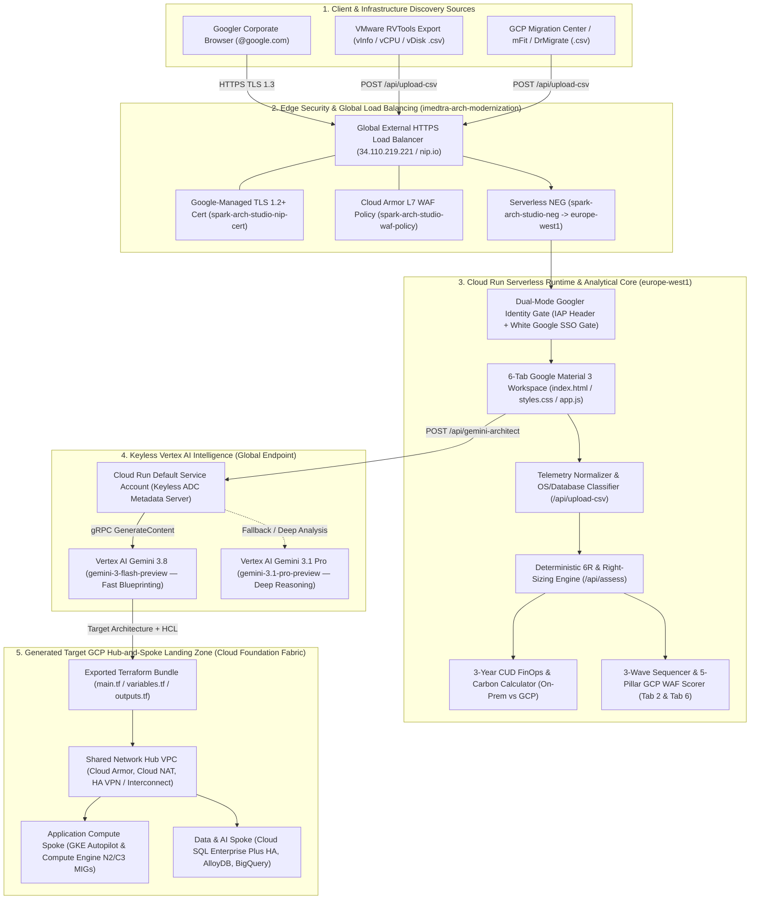

# 🚀 SPARK Architecture Modernization Studio (DrModernize)

> **End-to-End Enterprise Cloud Architecture Assessment, 6R Treatment Engine, Dependency Wave Planner, Google Cloud 5-Pillar Well-Architected Framework (WAF) Validator, and 3-Year Executive TCO Studio.**

Built for **Google Cloud EMEA Customer Engineering** (`//depot/google3/experimental/emea-oce-tooling/arch-modernization-studio`), combining the client-facing workflow of [DrMigrate](https://www.drmigrate.com/) with Google3's dynamic service mapping (`aws-to-gcp-service-mapper`), WAF scoring (`gcp-waf-validator`), and Cloud Run + Identity-Aware Proxy / Googler Gate deployment (`algolis-app-creator`).

---

## 🌐 Live Production Endpoints (`imedtra-arch-modernization`)

* **Secured External HTTPS Load Balancer (Googler-Only)**: [`https://spark-arch-studio.34.110.219.221.nip.io`](https://spark-arch-studio.34.110.219.221.nip.io)
* **Cloud Run Regional Service (`europe-west1`)**: [`https://spark-arch-studio-togaywrxaq-ew.a.run.app`](https://spark-arch-studio-togaywrxaq-ew.a.run.app)
* **AI Engine**: Vertex AI Global Publisher Endpoint (`gemini-3.8` / `gemini-3-flash-preview` & `gemini-3.1-pro-preview` with automatic multi-model fallback)

---

## 🏛️ Official Google Cloud Box Architecture Diagram (`creating-gcp-diagrams` & `go/genarch`)



📄 **Full Architecture Documentation & Sequence Flows**: See [`docs/ARCHITECTURE.md`](docs/ARCHITECTURE.md) and the interactive HTML box diagram at [`docs/spark_genarch_google_style_diagram.html`](docs/spark_genarch_google_style_diagram.html).

---

## 📐 End-to-End 5-Layer Platform & Target Landing Zone Architecture



---

## ✨ `go/genarch` (`https://genarch.corp.goog`) Specification & Prompt

### Structured Nodes & Typed Edges (`go/genarch` Schema)

```text
NODES:
- Multi-Cloud Discovery Telemetry: VMware RVTools CSV, AWS Migration Hub, Azure Migrate & Architecture PDFs
- Global External HTTPS Load Balancer: GCP Cloud Load Balancing (34.110.219.221.nip.io) with Managed SSL & Serverless NEG
- Googler Identity Gate: White Material 3 @google.com Gate + IAP JWT Header Verifier (X-Goog-Authenticated-User-Email)
- spark-arch-studio (Cloud Run): Serverless Python 3.11 Flask/Gunicorn runtime in europe-west1 (app/main.py)
- Rule-Based 6R & FinOps Engine: OS EOL detector, N2/C3/M3 VM right-sizer, and 3-Year CUD TCO calculator
- Dependency Wave & WAF Scorer: 3-Wave blast-radius sequencer and 5-Pillar Google Cloud WAF evaluator
- Cloud Run Default Service Account: Keyless Application Default Credentials (ADC) via Metadata Server
- Vertex AI Gemini 3.8: Foundation model endpoint (gemini-3-flash-preview) with fallback to gemini-2.5-flash
- Cloud Foundation Fabric Generator: Production Terraform bundle exporter (main.tf, variables.tf)
- Network Hub VPC: Cloud Armor WAF, Cloud NAT, Cloud Router, and HA VPN
- Workload Spokes (Compute & Data): GKE Autopilot, Compute Engine MIGs, Cloud SQL HA / AlloyDB, BigQuery & Vertex AI

EDGES (from -> to : what flows):
- Multi-Cloud Discovery Telemetry -> Global External HTTPS Load Balancer : HTTPS POST /api/upload-csv (TLS 1.3)
- Global External HTTPS Load Balancer -> Googler Identity Gate : Serverless NEG Request
- Googler Identity Gate -> spark-arch-studio (Cloud Run) : Verified spark_googler_session Cookie / IAP JWT
- spark-arch-studio (Cloud Run) -> Rule-Based 6R & FinOps Engine : Normalized Server Fleet JSON
- Rule-Based 6R & FinOps Engine -> Dependency Wave & WAF Scorer : 6R Strategy & Right-Sizing Matrix
- spark-arch-studio (Cloud Run) -> Cloud Run Default Service Account : Request OAuth2 Token (Keyless ADC)
- Cloud Run Default Service Account -> Vertex AI Gemini 3.8 : gRPC GenerateContentRequest{gemini-3-flash-preview}
- Vertex AI Gemini 3.8 -> Cloud Foundation Fabric Generator : Target Hub-and-Spoke Blueprint & WAF Remediation JSON
- Cloud Foundation Fabric Generator -> Network Hub VPC : Terraform Apply (Shared Hub VPC)
- Network Hub VPC -> Workload Spokes (Compute & Data) : VPC Network Peering & Private Service Connect
```

### Copy-Ready Prompt for `go/genarch`

Paste this prompt directly into **[go/genarch](https://genarch.corp.goog)** to generate the editable GCP Cards canvas:

```text
Create a left-to-right Google Cloud architecture diagram using GCP Cards and 4 grouped boundary containers for "SPARK Architecture Modernization Studio (Project: imed-test-project-1, Region: europe-west1)":

1. Group "1. Edge Security & Identity Gate" (Google Blue border):
   - Node "Multi-Cloud Discovery Telemetry": RVTools CSV, AWS Migration Hub, Azure Migrate, Architecture PDF
   - Node "Global External HTTPS Load Balancer": GCP Cloud Load Balancing (34.110.219.221.nip.io) with Managed SSL Certificate and Serverless NEG
   - Node "Googler Identity Gate": IAP JWT Header Verification (X-Goog-Authenticated-User-Email) and @google.com Session Cookie Gate

2. Group "2. Cloud Run Analytical Core (europe-west1)" (Google Red border):
   - Node "spark-arch-studio (Cloud Run)": Serverless Python 3.11 Flask & Gunicorn container
   - Node "Rule-Based 6R & FinOps Engine": OS EOL detection, N2/C3/M3 VM right-sizing, 3-Year CUD TCO calculator
   - Node "Dependency Wave & WAF Scorer": 3-Wave blast-radius sequencer and 5-Pillar Google Cloud Well-Architected Framework evaluator

3. Group "3. Keyless Vertex AI Intelligence" (Google Yellow border):
   - Node "Cloud Run Default Service Account": Keyless Application Default Credentials (ADC) via Metadata Server
   - Node "Vertex AI Gemini 3.8 (gemini-3-flash-preview)": Generative AI blueprint synthesizer with automatic fallback to gemini-2.5-flash

4. Group "4. Target Hub-and-Spoke Landing Zone" (Google Green border):
   - Node "Cloud Foundation Fabric Generator": Production Terraform (main.tf, variables.tf)
   - Node "Network Hub VPC": Cloud Armor WAF, Cloud NAT, Cloud Router, HA VPN
   - Node "Workload Spokes (Compute & Data)": GKE Autopilot, Compute Engine MIGs, Cloud SQL HA / AlloyDB, BigQuery & Vertex AI

Edges (left-to-right):
- "Multi-Cloud Discovery Telemetry" -> "Global External HTTPS Load Balancer" : "HTTPS POST /api/upload-csv (TLS 1.3)"
- "Global External HTTPS Load Balancer" -> "Googler Identity Gate" : "Serverless NEG Request"
- "Googler Identity Gate" -> "spark-arch-studio (Cloud Run)" : "Verified @google.com Session"
- "spark-arch-studio (Cloud Run)" -> "Rule-Based 6R & FinOps Engine" : "Normalized Server Fleet"
- "Rule-Based 6R & FinOps Engine" -> "Dependency Wave & WAF Scorer" : "6R Strategy & Right-Sizing"
- "spark-arch-studio (Cloud Run)" -> "Cloud Run Default Service Account" : "Request OAuth2 Token"
- "Cloud Run Default Service Account" -> "Vertex AI Gemini 3.8 (gemini-3-flash-preview)" : "gRPC GenerateContentRequest"
- "Vertex AI Gemini 3.8 (gemini-3-flash-preview)" -> "Cloud Foundation Fabric Generator" : "Target Blueprint & WAF Remediation JSON"
- "Cloud Foundation Fabric Generator" -> "Network Hub VPC" : "Terraform Apply (Hub VPC)"
- "Network Hub VPC" -> "Workload Spokes (Compute & Data)" : "VPC Peering / Private Service Connect"
```

---

## 🌟 Core Capabilities (6-Tab Google Material 3 Workspace)

1. **`1. Load Data`**:
   - One-click enterprise estates (**50-Server Enterprise Estate**, **Retail & E-Commerce**, **Financial Services Core**) or custom **RVTools / Migration Center CSV Upload** (`POST /api/upload-csv`) with downloadable 50-server sample CSV (`GET /api/sample-csv/50-servers`).
2. **`2. Architecture`**:
   - Interactive **Source-to-Google Cloud Target Topology Canvas** + **5-Layer End-to-End Platform Architecture Pipeline** across Google's 4-color design system (`#4285F4` Blue, `#EA4335` Red, `#FBBC05` Yellow, `#34A853` Green).
3. **`3. Costs & 6R`**:
   - Automated **6R Strategy Assignment** (*Rehost, Replatform, Refactor, Replace, Retain, Retire*), VM right-sizing (`n2-standard`, `c3-standard`, `m3-megamem`), and 3-Year CUD FinOps savings comparison.
4. **`4. AI Blueprint`**:
   - Live **Vertex AI Gemini 3.8 (`gemini-3-flash-preview`)** synthesis of executive modernization blueprints, Hub-and-Spoke landing zones, and database migration strategies.
5. **`5. Terraform`**:
   - 1-click export of **Google Cloud Foundation Fabric** Terraform (`main.tf`) provisioning Shared Hub VPC, Cloud Armor WAF, GKE Autopilot clusters, Compute Engine MIGs, and Cloud SQL HA instances.
6. **`6. Waves & WAF`**:
   - **3-Wave Migration Execution Plan** (Wave 1 Foundation & Quick Wins, Wave 2 Core App & DB Modernization, Wave 3 Mission-Critical Refactoring) + **5-Pillar Google Cloud Well-Architected Framework (WAF)** scorecard and remediation matrix.

---

## 🛠️ Build, Test & Run Locally (Blaze)

```bash
# 1. Build application binary
/google/bin/releases/arca9-local-blaze-cli/blaze-for-agents build //experimental/emea-oce-tooling/arch-modernization-studio/app:app

# 2. Run local server on port 8085 with Gemini 3.8
PORT=8085 VERTEX_AI_MODEL=gemini-3.8 ./blaze-bin/experimental/emea-oce-tooling/arch-modernization-studio/app/app
```
