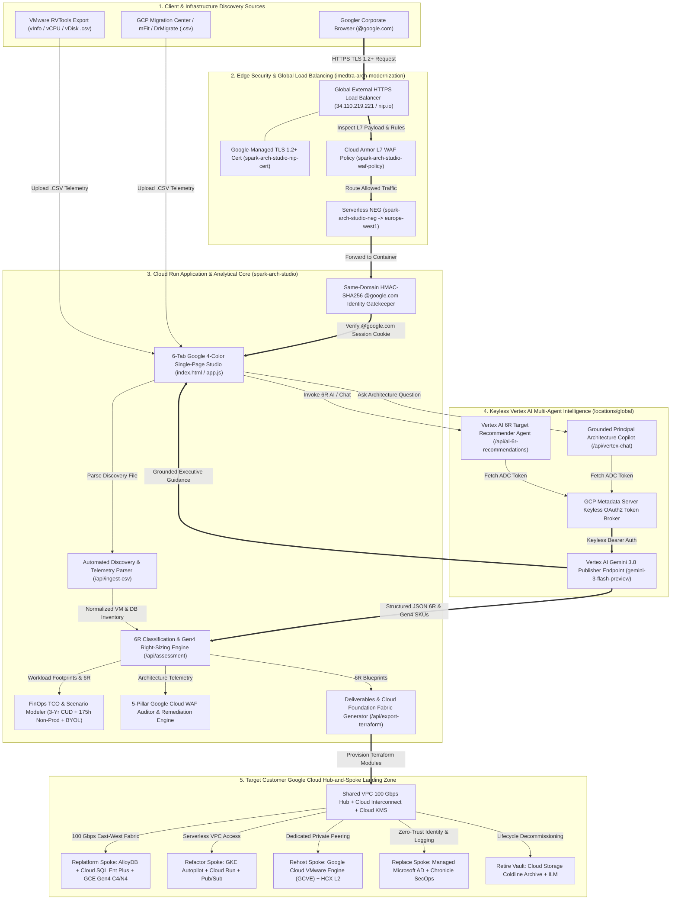
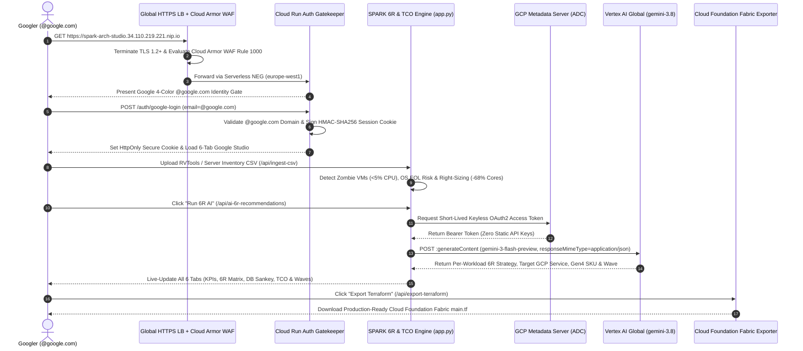

# SPARK Architecture Modernization Studio — Full System & Target Architecture

> [!NOTE]
> **Live Production Endpoints (`imedtra-arch-modernization`)**
> - **Secured External HTTPS Load Balancer (Googler-Only)**: `https://spark-arch-studio.34.110.219.221.nip.io`
> - **Cloud Run Regional Service (`europe-west1`)**: `https://spark-arch-studio-togaywrxaq-ew.a.run.app`
> - **AI Engine**: Vertex AI Global Publisher Endpoint (`gemini-3.8` / `gemini-3-flash-preview` & `gemini-3.1-pro-preview`)

---

## 0. Official Google Cloud Box Architecture Diagram (`creating-gcp-diagrams` & `go/genarch`)

---

## 1. End-to-End 5-Layer System & Target Landing Zone Architecture

> **Note:** To view or edit this diagram, [click here](http://go/mermaid-viewer#data=gzip:H4sIAAAAAAAC/41XXXPbthL9Kzt6yLiTUo7kj/Rmpp3K1IfVSLYqys5t6z5AJEShhgAWBGUrzf3vdxcgKUrRTPokAMQeLHbPnoX+acU64a0PrZXUL/GaGQuL/pMCyItlali2hgnbcdOBP55anTaEUnBl4Q2M1cqw3JoitoXh0Bd5rLfc7CDShYl5/tT6k1AARlqnkhs0L0cQapNpwyyHG6Nfclw5+zl139qx3nxXW84fF1rLHC0fpy8MDykXYPCK9hbOtuiEhnPYhrMH+kEnnqEd59s9xlSkITrszw9nNMeThVbgl9FsMxQWf/rGf+Nw1oTgKnlSX8ejS/HotmGQpBwiHhdG2B2GZST1kkmYaJbADZNMxUKlcCY2PLGGBczE62CDATdKfHZ+7F0dTW7ISQ8weEXnFA5uF4tZ1MSjcF1ctjudd+1u5z/tbreDziuRtYXeY0XRJOTG1kEPpkyxlCewmETQaXffAn2Gszxj5tl7ldsiETpApADPsHusUOoi6ZmNphi6CbgZTN7Dp94QZlqKeHcK64Wtgsx9bXh2NxghTsQNskXyPAdcOOkITyH4CXhhdMaDF57bzjdyckE5uWh7h2FeKOhlGZ7u8/0GehjPncW5JAryE4fu3ewVdj1CMpCrbMODvt4woeB22guD6LbXvbqGBmdhnCCbiAFk88x5xk0N9YkvH8aIcx0s2LIsB7gMQi0xhhHSA9MzY0Qj5wOSRSX8tb22G4mZZVnW/itvZCN6nDGTO0Kjk+iWxbTuy+8NLLjkG25x7DfC2TnLxDkehDEMDqojEq/zgUqFontezzFyLM/Fah+yEVeXMBfp2gaR+ExU9ttLTNyNGdzg3feYQ6Hus7xG9VNYhPcIF8VcMYN3nGIJSMfk4DcUhIc+vIXO+6s13GkVzIxOcH7z2/1kD4tM62F4rGPhVTATUjJTRdNnnMhY7sGz5hiERPiLeG9qrDEL8WIci92h9bkUGDu2RDqioQcb6kIl3nrIlkbEUJuUl+dOhQKsU8NW2my+wc5LYudlGz7ynaP9IxYZf4XeGKaFtCLopSSsYxQlKQWOYwyy1D4T+XnqZKGha9yyhX7mqtI1nKO7DHxh1afcE5G74LaS3D43iDniG6HExQ8ksLUzfhEu2j/ArFhKka8RbaCSTAt07yx1n4OLYIVUWQeZ4VvBXxp1Q7e4nh9AIrEWzKTcYk6wWJAuqH9+Z8UjEVybwFRf/Z2PQEOdCamdpBnKDbJ+ZgTqa4b13MMaFpb7XlTuLLG3zo8AW5v9RoauKENX7crZsMixvPgRyW6LZcBUEkQZxhLtVEJV8btu0CvCLsqTx1lI4uHGgBPovHsHoyXWAkIgvT0c5dvEWin0vV78OI1qMEKe80wySxxDxP0EnA8foCel3vVvavPo1wlmzMJMFjkujsKBr+Pw8vzu8gh4xWJfBNWwAh19HJAIlqF82xDVt0SM86hYHkGtdW4dEA1qmGbsyjZeScgofBx8h3C34X9h0v36xjGvrou1UOJVfWwqYqNzvbLQI+0I10YrEUvXi1FvjsCsMB6LBvDIsOA+VMHCO5P4ohwnktxyVNpyBB1PpseEqZ4wP/7405enlu/NdUud878LlNin1hfq5bS9erAEAW1/yCS18TZK+F6kabfrELS/fq38Swvn0uQGdwdVy6+WvIdjlWfELGzVM7ZzYKiMhaT32ZdGZyer/aw0nusCX0PErhd6OaDKYWcgO+rhZEG/5d6hNpjbBKzGSCqLvZKE5kvdR72v1aw0QokQq91BI41QtNzrTOtnwQ+C4wZlYFxna3S9oZBuc90d3YWqSWl0hzXDpPhM9TjFOGDJjNUW4619UPfd0F2unpXmn7R5dhEcam0zlB5L3eJ6TqbNpnfS+ECgDlNZN7aThiieN7Lg/jza32xePqrNwOCFSJfQCoX3HOuCOT6Wsny8u4fv5QPPfiUCY/xrm1JLXfI8Rmk65DZeY/GFvreQQd2T6t2VEv87k3pS0qPqYTccVcM8rjaKtuWY3o5Li2i6v9IAr9E93cUhvINE318yL/O8ZF53VgGr/iit6QCo0Ik9Og+KrpmEkpjfLVshePuonoR0DOnqrW6KbgsV5MyMnVrGOBfquAT5qB8dJDlYQc4Zd54TNNiL8b/X/ne1Av7KcM+vpBi94DEVrqlwpxxrEmV7o1JzE+Z/s6NDhYGe+T+8fsG/6ek6YG5E+9T9hOx4vGOFLvv2r5wdX9gS2Ld+r6FSUnXrQ8rJnP+fWvj/62i47b1v/8DN+Nug70OAAA=).

---

## 2. Zero-Trust Authentication & Vertex AI Execution Sequence

> **Note:** To view or edit this diagram, [click here](http://go/mermaid-viewer#data=gzip:H4sIAAAAAAAC/3VVbW/bNhD+KwcDGxzUlGM3NTpjLabIjmMkmQVLToAiX2jpInOWSJWknHjD/vuOVJy4SfeNpO65u+e5F/3TyVSOnXHH4PcGZYYTwQvNq3sJwBurZFOtUftbZpWGlUEN3MBMqaKkY/ePwp+CTFUnzqzm2opM1FxamF2fe9tSrXkJl2kaJ0BPHyAqVZNDqCvyeBdevMNxiw7Ymi0bCWFjN/55i1i3+RwDEtvkQjlIEofLKxgt4VdIowVMZSEkQpfXdVDv3yV4g5b7DKPYn3NO9wT1zjELJ9E7wC1qi08O8nwK5wd63QIrIQX7GHx+B7vgay2yV0oXqpEUSyh5+DR9qhU5JGYO61RmX7+SfmOYTVPYWFubcb9vyOmWcZ1tmPGUg49nwWBwGgwHvwXD4SCQog6Eci4Ie/CQoqbMnKbpdQKDYPiB1JnueNm4tze1ILlLhMHp6emRF7IbU9L6kescduKgUYnGwJ/TGXSx0apG9ojGDjx7B2EEdUzGEGs06ArrewXOWKRKCnfUOzDPyUDYvUcea+Bjx4skhT415KbfYlipqLIUuOKi/PK2CX30A/aWlyJ3TI/DTRQBJemQiELC5U0YseQyHH4aETVjXGEipbYC33NJ0MIl1WMhyz1dskbjsy15u1Y8hxFL+frAtW3NI0LtwxhWdemMl7epUqWB/qHv5nJHSii9hyi5hW6f16IvZEHKsszsPL3WxZGvCVrMLHxT1ZrSuL0x0P390y8QxauTHiwSmC6uYSnMljJcimJjWSL+Jp/QZaPPZKaoPCc/STEqRbaF+46bQBqpcH7feU6ICzbSTCNJWeFzK5sfc3PzNIalWyuGJnRD7c2uxQ5zuMK975yFm+ohhFnmbqnaom9+B2RHWSzRNlrCOXJN8ngz6H5DrSgWBc4gjOfO55v47YA+t864QIma6hgpaV0nvkwreyi52bBa407gYw9Iipq44I2oMN3X+IVWB8ngGfb/Mkr6KK3zn2QZk4B3Sm99bUmzxLqoxb4HKdcFtY5bNa7SIsMezFCeQXK1orrc8R0e5f/Sbk4ytqp9A4dlCSNytKb6XsVz03MRbrjV4qkHk3NIuNyiC0Wbr/X4Q1nbVfNa1nbnuPWg+YPS1Ut10X9g9vDBO2nRr4lN1KP0LGOt8iZz+rAl8nz/vzvOTVxgHzq9jlZNsemMH3hpsNep2j8Q5sJ2/v0PUUKYoZEGAAA=).

---

## 3. Architecture Layer & Resource Specifications

| Architecture Layer | Google Cloud Resource / Component | Identifier & Region | Key Responsibilities & Security Controls |
| :--- | :--- | :--- | :--- |
| **1. Edge & Network Security** | Global External Application Load Balancer + Cloud Armor WAF | `spark-arch-studio-https-proxy` (`34.110.219.221` / `nip.io`) | Enforces Google-Managed TLS 1.2+ (`MODERN` SSL Policy `spark-arch-studio-tls12-policy`) and Cloud Armor L7 WAF (`spark-arch-studio-waf-policy` Rule `1000`). |
| **2. Identity & Access Gate** | Same-Domain `@google.com` Corporate Identity Gatekeeper | `verify_iap_googler_identity` ([app.py](file:///google/src/cloud/imedtra/arch_modernization_assessment_tool/google3/experimental/emea-oce-tooling/arch-modernization-studio/app/app.py#L2000-L2096)) | Strictly validates `@google.com` corporate emails and issues signed `HttpOnly; Secure; SameSite=Lax` HMAC-SHA256 cookies (`spark_googler_session`). |
| **3. Application & Analytical Core** | Cloud Run Container Service (`europe-west1`) | `spark-arch-studio` ([index.html](file:///google/src/cloud/imedtra/arch_modernization_assessment_tool/google3/experimental/emea-oce-tooling/arch-modernization-studio/app/static/index.html), [app.js](file:///google/src/cloud/imedtra/arch_modernization_assessment_tool/google3/experimental/emea-oce-tooling/arch-modernization-studio/app/static/app.js)) | 6-tab Google 4-color studio performing RVTools CSV ingestion, Zombie VM detection (`<5%` CPU), Gen4 C4/N4 right-sizing (`-68%` cores), and FinOps TCO modeling. |
| **4. Keyless Vertex AI Engine** | Vertex AI Gemini 3.8 Global Publisher Endpoint | `locations/global/publishers/google/models/gemini-3-flash-preview` | Keyless ADC OAuth2 inference powering the **Structured JSON 6R Target Recommender Agent** (`/api/ai-6r-recommendations`) and **Architecture Copilot** (`/api/vertex-chat`). |
| **5. Target IaC & Landing Zone** | Google Cloud Foundation Fabric Exporter | `/api/export-terraform` ([app.py](file:///google/src/cloud/imedtra/arch_modernization_assessment_tool/google3/experimental/emea-oce-tooling/arch-modernization-studio/app/app.py#L1408-L1570)) | Generates production-ready Terraform blueprints (`net-vpc`, `compute-vm`, `alloydb`, `cloudsql`, `gke-autopilot`) across a 100 Gbps Shared VPC Hub-and-Spoke topology. |
